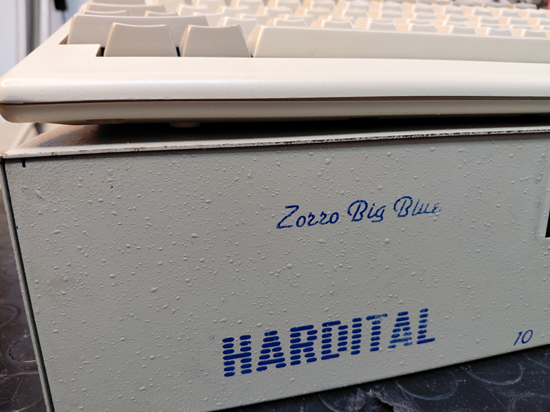
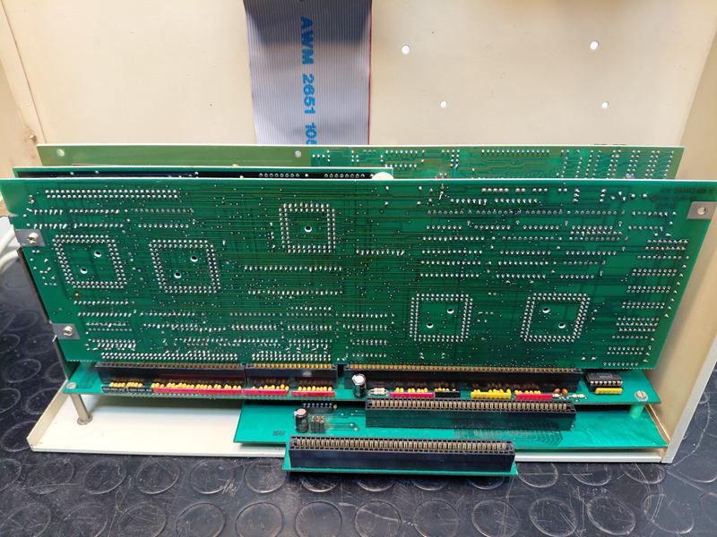
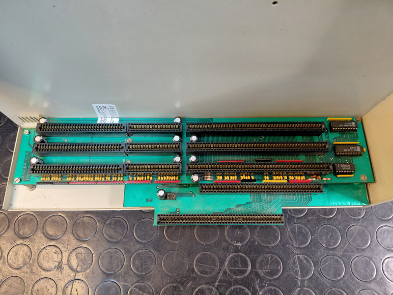
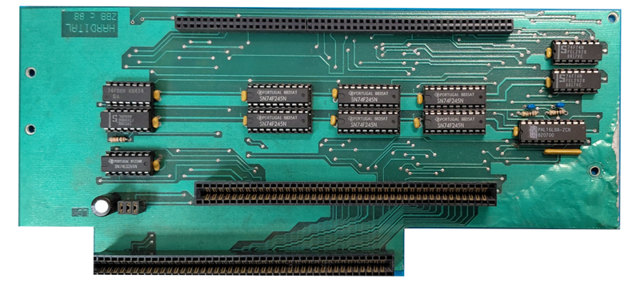
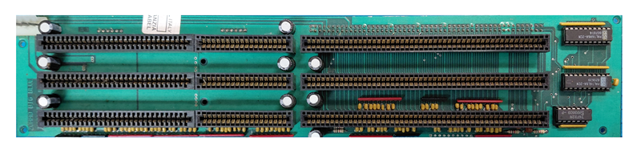

# HARDITAL Zorro Big Blue

Reverse engineering of **Hardital Zorro Big Blue**, an Italian Amiga expansion produced in the late 1980s.

## What it was
The Zorro Big Blue was an external metal cabinet (roughly 46×37×15 cm) that gave Amiga 500 owners — and Amiga 1000 owners, possibly with some modifications — the expansion capabilities normally reserved for the Amiga 2000. It connected to the host through the 86-pin side expansion connector and provided a backplane with **three Zorro II slots and three ISA slots**, plus drive bays for 3.5" and 5.25" floppies, a hard disk bay, a cooling fan, and a 40W power supply.
The ISA slots could not host PC cards directly from the Amiga side: they were usable only in combination with an x86 bridgeboard installed in the system, and the ISA cards remained accessible only to the PC side of that setup. The name "Big Blue" refers to this PC-compatibility angle ("Big Blue" being IBM's nickname). 
At the time of [The Games Machine](Misc/TGM.jpeg) review ( by Carlo Santagostino November 1989), the system retailed for 180,000 Italian Lire for the backplane plus 150,000 Lire for the chassis, a competitive alternative to buying a full Amiga 2000.
  
 
 

  

## What this repository contains

Reverse engineering of the programmable logic on the system, distributed across two interconnected boards:

**Board A** — host interface and transceiver steering between the host Amiga and the backplane  
  
**Board B** — Zorro II backplane carrying the three slots, with bus arbitration, address decoding, and Amiga collision detection  
  

The two `PAL16L8` chips (steering on Board A, collision detection on Board B) were fully extracted using [DuPAL](https://github.com/DuPAL-PAL-DUmper) and reimplemented as documented `GAL16V8` replacements with annotated CUPL sources. Minor differences between the original PALs and their GAL replacements — tri-state behavior, product term limits, polarity conventions — are noted in the source files.

The `PAL16R8` used for Zorro bus arbitration (on Board B) was **not** fully decoded: DuPAL doesn't reliably handle registered outputs (the state space requires specific clock sequences that brute-force extraction can't fully explore). Its equations were instead reconstructed by comparing the chip's response to the [Peeper](https://github.com/DuPAL-PAL-DUmper/DuPAL_Peeper) with the schematics of the early Amiga 2000 revision, which uses a functionally similar arbitration block.

The repository includes:

- Reconstructed KiCad schematics of both boards
- Annotated CUPL sources for the GAL replacements, with inline documentation of design decisions

## A note on the board condition

The unit examined for this reverse engineering shows several signs that suggest it is **not a final production board** but rather a prototype or a pre-production revision:

- **Multiple bodge wires**: several PCB traces have been cut and rerouted with flying wires, both on the signal layer and on what should be solid ground areas
- **Missing components**: the AC termination resistor network on seven bus lines (A22, A23, D11-D15) was desoldered at some point and never reinstalled; its corresponding capacitors remain in place but are electrically inert without the resistor
- **Hardwired override**: SLVOUT (an output of the collision detection PAL) is shorted directly to GND, in direct conflict with the PAL's output driver — a configuration that disables the original collision-handling protocol between the Amiga-side and ISA-side logic
- **Inconsistencies in the PAL logic** point in the same direction: the arbitration PAL has the BG0 output programmed as permanently inactive, making slot 0 non-mastering by design, and the steering PAL on Board A actively drives an AOE (Address Output Enable) signal whose corresponding pin on the package is not connected to anything on the PCB — meaning the PAL programming carries logic for a function the board doesn't physically use

Whether these are factory choices in a cost-reduced design, leftover modifications from a pre-production prototype, or later field hacks by a previous owner is impossible to say with certainty without comparing against other surviving units. The reverse engineering documented here describes **the board as found**, with notes where the original design intent can be reasonably inferred.

## Hardware validation

The reverse-engineered logic has been validated on real hardware in its period-correct configuration: **Amiga 500 + Kickstart 1.3 + Zorro II memory expansion**. In this setup the system boots and operates, with all three Zorro II slots functional for passive cards (RAM, I/O).

A few limitations emerged during testing and are worth documenting:

- **Slot 0 does not support bus mastering.** This is by design in the original PAL programming, not a fault. DMA-capable cards (SCSI controllers, accelerators with onboard DMA) must be installed in slot 1 or 2.
- **DMA SCSI controllers work with difficulty.** The Commodore A2091 operates in the configuration above but with occasional read errors during sustained transfers. PIO-only SCSI controllers would likely be a better match for this board.
- **Kickstart 2.0+** has not been validated with DMA SCSI cards. Period-correct Kickstart 1.3 is the recommended configuration.
- **Bus signal quality** is at the edge of specification, consistent with the cost-reduced design of the cabinet and likely contributing to the SCSI DMA errors. Marginal +5V regulation under load, clock distribution through the buffered bus, and 30-year-old connector contacts all contribute.

In short: the Big Blue is fully functional for its intended use case (light expansion of an A500 with period-correct software), and the limitations are inherent to its 1989 design philosophy rather than to faults in the hardware.

## Credits and sources

- Period reviews from *Commodore Computer Club* and *The Games Machine* magazines (1989)
- The [DuPAL]([https://github.com/AlessandroDeLuca/dupal](https://github.com/DuPAL-PAL-DUmper)) project for the combinational PAL extraction
- Early Amiga 2000 schematics, for cross-reference on the arbitration logic

## Thanks
A big thank you to Carlo Santagostino for providing HARDITAL Zorro BigBlue and historical memory

If you found this my work useful, please consider buying me a cup of coffee if you want: 

## License

This work is licensed under a Creative Commons Attribution 4.0 International License. See [https://creativecommons.org/licenses/by/4.0/](https://creativecommons.org/licenses/by/4.0/).
